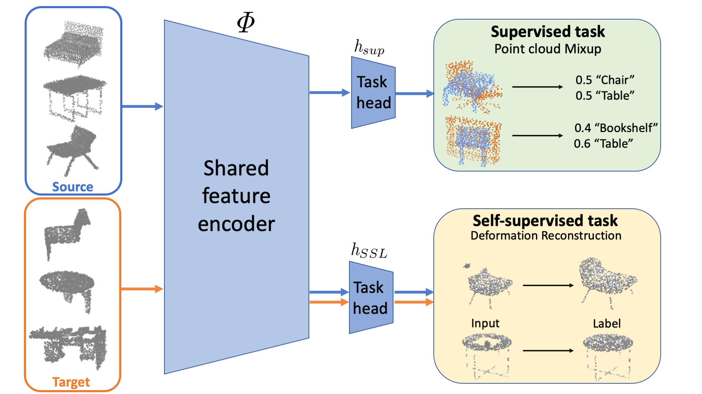
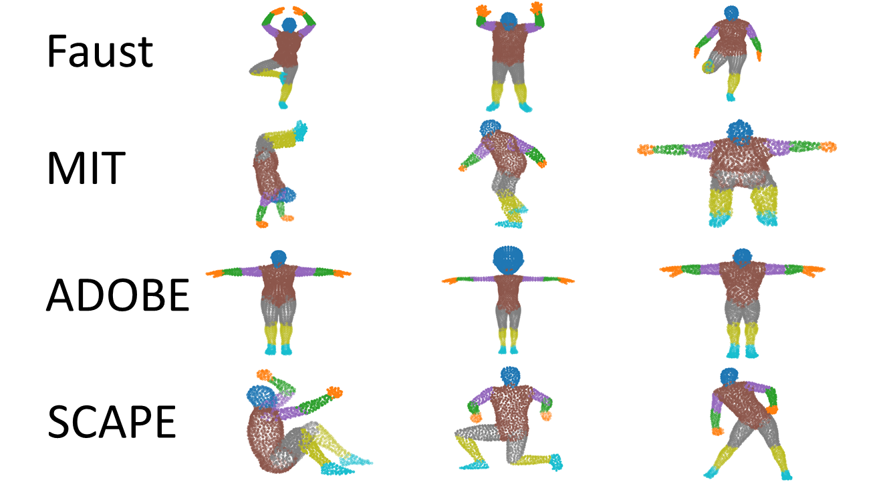
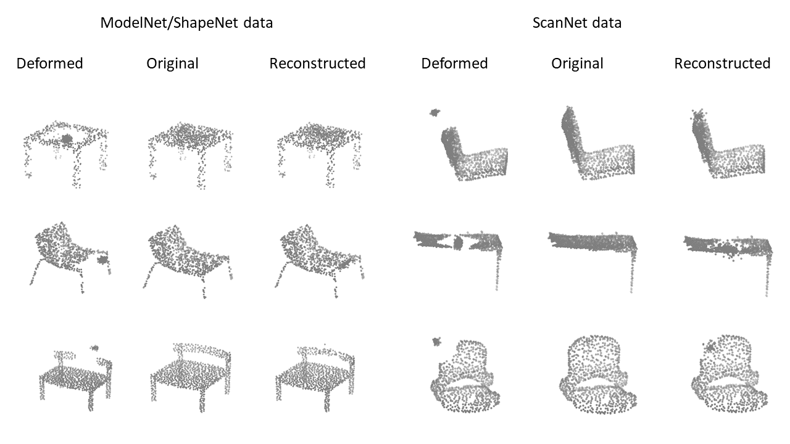

# Self-Supervised Learning for Domain Adaptation on Point-Clouds

<p align="center"> 
    
</p> 
 
 ### Introduction
Self-supervised learning (SSL) allows to learn useful representations from unlabeled data and has been applied effectively for domain adaptation (DA) on images. It is still unknown if and how it can be leveraged for domain adaptation for 3D perception. Here we describe the first study of SSL for DA on point clouds. We introduce a new family of pretext tasks, Deformation Reconstruction, motivated by the deformations encountered in sim-to-real transformations. The key idea is to deform regions of the input shape and use a neural network to reconstruct them. We design three types of shape deformation methods: (1) Volume-based: shape deformation based on proximity in the input space; (2) Feature-based: deforming regions in the shape that are semantically similar; and (3) Sampling-based: shape deformation based on three simple sampling schemes. As a separate contribution, we also develop a new method based on the Mixup training procedure for point-clouds. Evaluations on six domain adaptations across synthetic and real furniture data, demonstrate large improvement over previous work.

[[Paper]](https://arxiv.org/pdf/2003.12641.pdf)

### Instructions
Clone repo and install it
```bash
git clone https://github.com/idanachi/DefRec_and_PCM.git
cd DefRec_and_PCM
pip install -e .
```

Download data:
```bash
cd ./xxx/data
python download.py
```
Where xxx is the dataset (either PointDA or PointSegDA)


### Citation
Please cite this paper if you want to use it in your work,
```
@article{achituve2020self,
  title={Self-Supervised Learning for Domain Adaptation on Point Clouds},
  author={Achituve, Idan and Maron, Haggai and Chechik, Gal},
  journal={arXiv preprint arXiv:2003.12641},
  year={2020}
}
```
 ### PointSegDA dataset
<p align="center"> 
    
</p>

### Shape Reconstruction
<p align="center"> 
    
</p> 
 
 
### Acknowledgement
Some of the code in this repoistory was taken (and modified according to needs) from the follwing sources:
[[PointNet]](https://github.com/charlesq34/pointnet), [[PointNet++]](https://github.com/charlesq34/pointnet2), [[DGCNN]](https://github.com/WangYueFt/dgcnn), [[PointDAN]](https://github.com/canqin001/PointDAN), [[Reconstructing_space]](http://papers.nips.cc/paper/9455-self-supervised-deep-learning-on-point-clouds-by-reconstructing-space), [[Mixup]](https://github.com/facebookresearch/mixup-cifar10)


